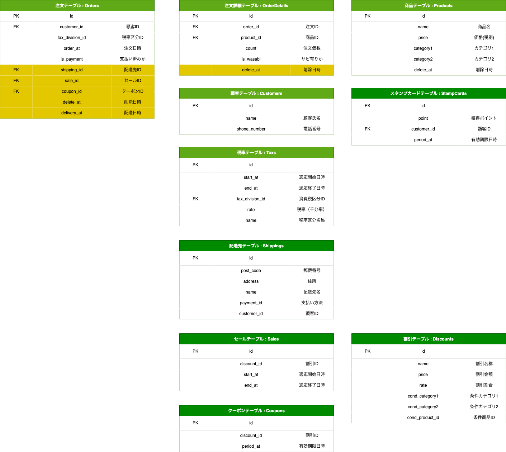

## 課題1


### 補足
- 注文テーブル
  - 注文情報が格納される。
- 注文詳細テーブル
  - 1つの注文に対し、複数のレコードが格納される。
- 商品テーブル
  - 商品ごとのデータが入るマスタテーブル。
  - カテゴリ1は、「セットメニュー, お好みずし」、カテゴリ2は、「盛り込み, 一皿...」の定数値が入る想定。（検索用）
  - 商品価格変更時は、新たにレコードを追加し、削除日時を登録する想定。
- 顧客テーブル
  - 顧客情報が格納される。
- 税率区分テーブル
  - 店内飲食、持ち帰りで税率が変化するため。
- 税率テーブル
  - 税率が変化する際に、レコードを追加。

---
## 課題2

課題1にあるOrderDetailテーブルにシャリのサイズを登録するカラムを追加する。


特定の商品の売上個数を取得する。
```
select sum(count) from order_details where product_id = 1;
```

お好み寿司内で一番売れている商品情報を取得する。
```
select sum(count) as max_count, product_id from order_details where product_id in (select id from products where category1 = 2) group by product_id order by sum(count) desc limit 1;
```


---
## 課題3

<details><summary>自分の考えた追加仕様</summary>

```rb
スタンプカードの導入。
1000円以上お買い上げごとにスタンプが押され、10個ごとに500円分のクーポンコードが発行されるようになった。
スタンプの有効期限は、1年間。
クーポンコード交換後の有効期限は、1ヶ月間となっている。
```
</details>


<details><summary>トリオが考えた追加仕様</summary>

```rb
出前の考慮
住所や郵便番号の追加が必要
Aamzonで自宅住所以外にも配達ができることを考えると、顧客マスタの住所に届けるとは限らないため実際に届ける住所は注文履歴に持つべきかも
注文履歴に決済方法があるといいかも
優待セールで１週間だけ10%オフ（メニューはそのまま）
ポイントカード
メニューの追加
ex. 飲み物や汁物など
注文履歴、注文詳細は論理削除想定（注文後のキャンセルなど
キャンセルやっぱり論理削除じゃなくてステータスで判断の方が良さそう
セットメニューの「盛り込み」「にぎり」：お好みすしの組み合わせで構成されている場合、単にお好みすしの商品ID、個数を保持するテーブルでメニューの組み合わせを実現できるようにする？

・キャンセル状況を確認できる
・受け取り日時を確認できる
→ 注文〜受け取り時間とキャンセルの関係を分析を可能に
・ポイントカード・クーポンの割引
・会員優待
→ チェーン展開ならあるかなと
```
</details>

まとめた追加仕様
- スタンプ（ポイント）カードの導入。
- クーポン、会員優待などの割引券を追加。
- 店頭販売だけでなく、出前を考慮。
- 複数の住所を登録できるようにし、注文ごとに住所を選択できるようにする。
- 決済方法の追加（各住所に紐づくよう対応）
- 注文キャンセルを考慮し、注文履歴、詳細に倫理削除追加。
- 受け取り時間、注文キャンセル時間を追加。
- 優待セールの追加。

- セール期間中のクーポンは使用可能。
- 複数のクーポンは、併用不可。
- セールとクーポンで値引きされる商品は、対象を「全て」「カテゴリごと」「特定の商品」を設定でき、「割引率」と「割引価格」を設定できる。

濃い緑: 追加テーブル<br>
黄色: 追加カラム


---
## 課題4

<details><summary>SQL</summary>


```rb
CREATE DATABASE IF NOT EXISTS db_modering1 ;
use db_modering1;

-- ===== 注文テーブル =====
CREATE TABLE orders(
    id int unsigned NOT NULL AUTO_INCREMENT,
    customer_id int unsigned NOT NULL comment '顧客ID',
    tax_division_id smallint unsigned NOT NULL comment '税率区分ID',
    order_at datetime DEFAULT NULL comment '注文日時',
    is_payment tinyint(1) comment '支払い済みか',
    PRIMARY KEY (id)
);

INSERT INTO orders VALUES
  (1, 1, 1, '2022-11-01', 0),
  (2, 2, 2, '2022-11-02', 1),
  (3, 3, 3, '2022-11-03', 1);

-- ===== 注文詳細テーブル =====
CREATE TABLE IF NOT EXISTS order_details (
    id int unsigned NOT NULL AUTO_INCREMENT,
    order_id int unsigned NOT NULL comment '注文番号',
    product_id int unsigned NOT NULL comment '商品ID',
    count tinyint unsigned NOT NULL comment '注文個数',
    is_wasabi tinyint(1) comment 'サビ有りか',
    PRIMARY KEY (id)
);

INSERT INTO order_details VALUES
  (1, 1, 1, 1, 0),
  (2, 1, 1, 1, 1),
  (3, 1, 2, 1, 1),

  (4, 2, 3, 1, 0),
  (5, 2, 4, 1, 0),

  (6, 3, 5, 1, 0);

-- ===== 商品テーブル =====
CREATE TABLE IF NOT EXISTS products (
    id int unsigned NOT NULL AUTO_INCREMENT,
    name varchar(20) comment '商品名',
    price smallint unsigned NOT NULL comment '価格',
    category1 tinyint unsigned NOT NULL comment 'カテゴリ1',
    category2 tinyint unsigned NOT NULL comment 'カテゴリ2',
    delete_at datetime DEFAULT NULL comment '削除日時',
    PRIMARY KEY (id)
);

INSERT INTO products VALUES
  (1, '玉子', 100, 2, 1, null),
  (2, 'いなり', 100, 2, 1, null),
  (3, '納豆軍艦', 100, 2, 1, null),
  (4, 'ゆでげそ', 150, 2, 2, null),
  (5, 'とびっこ', 150, 2, 2, null),
  (6, 'はな', 8650, 1, 1, null);

-- ===== 顧客テーブル =====
CREATE TABLE IF NOT EXISTS customers (
    id int unsigned NOT NULL AUTO_INCREMENT,
    name varchar(20) comment '顧客氏名',
    phone_number varchar(15) comment '電話番号',
    PRIMARY KEY (id)
);

INSERT INTO customers VALUES
  (1, '田中 太郎', '080-xxxx-xxxx'),
  (2, '小林 二郎', '090-xxxx-xxxx'),
  (3, '山田 三郎', '090-xxxx-xxxx');

-- ===== 税率区分テーブル =====
CREATE TABLE IF NOT EXISTS tax_divisions (
    id int unsigned NOT NULL AUTO_INCREMENT,
    name varchar(20) comment '税率区分名称',
    PRIMARY KEY (id)
);

INSERT INTO tax_divisions VALUES
  (1, '標準税率'),
  (2, '軽減税率');

-- ===== 税率テーブル =====
CREATE TABLE IF NOT EXISTS tax (
    id int unsigned NOT NULL AUTO_INCREMENT,
    start_at datetime NOT NULL comment '適応開始日時',
    end_at datetime NOT NULL comment '適応終了日時',
    tax_division_id smallint comment '消費税区分ID',
    rate smallint(4) comment '税率（千分率）',
    PRIMARY KEY (id)
);

INSERT INTO tax VALUES
  (1, '1000-01-01 00:00:00', '9999-12-31 23:59:59', 1, 100),
  (2, '1000-01-01 00:00:00', '9999-12-31 23:59:59', 2, 80);

```
</details>
