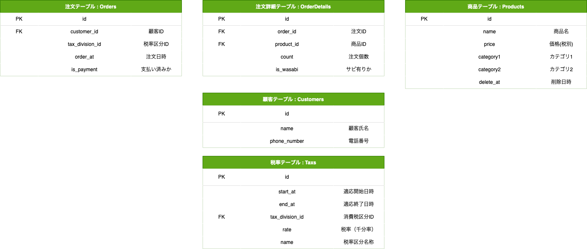

## 課題1

---
## 課題2

課題1にあるOrderDetailテーブルにシャリのサイズを登録するカラムを追加する。

課題1にあるOrderDetailテーブルから特定のProductIdのデータを取得し、個数を合計する。

---
## 課題3

スタンプカードの導入。

1000円以上お買い上げごとにスタンプが押され、10個ごとに500円分のクーポンコードが発行されるようになった。

スタンプの有効期限は、1年間。

クーポンコード交換後の有効期限は、1ヶ月間となっている。
