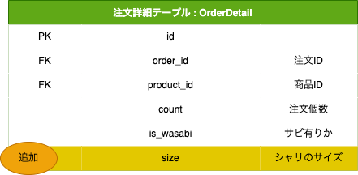

## 課題1

### 補足
- 注文テーブル
  - 注文情報が格納される。
- 注文詳細テーブル
  - 1つの注文に対し、複数のレコードが格納される。
- 商品テーブル
  - 商品ごとのデータが入るマスタテーブル。
  - カテゴリ1は、「セットメニュー, お好みずし」、カテゴリ2は、「盛り込み, 一皿...」の定数値が入る想定。（検索用）
  - 商品価格変更時は、新たにレコードを追加し、削除日時を登録する想定。
- 顧客テーブル
  - 顧客情報が格納される。
- 税率区分テーブル
  - 店内飲食、持ち帰りで税率が変化するため。
- 税率テーブル
  - 税率が変化する際に、レコードを追加。

---
## 課題2

課題1にあるOrderDetailテーブルにシャリのサイズを登録するカラムを追加する。

課題1にあるOrderDetailテーブルから特定のProductIdのデータを取得し、個数を合計する。

---
## 課題3

自分の考えた追加仕様

> スタンプカードの導入。 
> 1000円以上お買い上げごとにスタンプが押され、10個ごとに500円分のクーポンコードが発行されるようになった。 
> スタンプの有効期限は、1年間。 
> クーポンコード交換後の有効期限は、1ヶ月間となっている。

---
## 課題4
