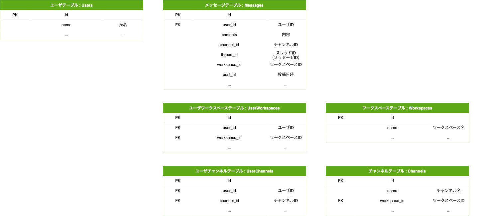
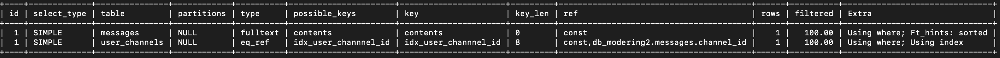

## 課題1



ユーザが参加しているチャンネルのメッセージ検索
（ワークスペースは指定不要な認識）
```
SELECT contents FROM messages WHERE channel_id IN (
  SELECT channel_id FROM user_channels WHERE user_id = 1
) AND MATCH (contents) AGAINST ('返信' IN BOOLEAN MODE);
```

EXPLAIN実行結果


補足

MySQL5.6からサポートされた全文検索、<br>
MySQL5.7からサポートされたNgramパーサーを使用する想定。

LIKE検索よりも高速と言われている。<br>
LIKEで検索文字列前にワイルドカードを使用する場合、インデックスが効かないので、その場合には、全文検索を使用するのが良いと判断しました。<br>
（今回の場合、部分一致）

全文検索の場合は、テーブルを跨いでしまうとインデックスが有効にならないため、スレッドメッセージもメッセージテーブルに格納するようにしております。<br>
（スレッドメッセージではない場合、thread_idは0が入る想定）

以下のリンクにて、速度検証行いました。<br>
[速度検証](https://github.com/k-takeuchi220/mysql-fulltext-ngram)

<details><summary>テスト用SQL</summary>

```rb
CREATE DATABASE IF NOT EXISTS db_modering2 ;
use db_modering2;

-- ===== ユーザテーブル =====
CREATE TABLE users(
    id int unsigned NOT NULL AUTO_INCREMENT,
    name varchar(20) comment '氏名',
    PRIMARY KEY (id)
);

INSERT INTO users VALUES
  (1, '田中'),
  (2, '小林');

-- ===== メッセージテーブル =====
CREATE TABLE IF NOT EXISTS messages (
    id int unsigned NOT NULL AUTO_INCREMENT,
    user_id int unsigned NOT NULL comment 'ユーザID',
    contents TEXT NOT NULL comment '内容',
    channel_id tinyint unsigned NOT NULL comment 'チャンネルID',
    thread_id tinyint unsigned NOT NULL comment 'スレッドID',
    workspace_id tinyint unsigned NOT NULL comment 'ワークスペースID',
    post_at datetime NOT NULL comment '投稿日時',
    PRIMARY KEY (id)
);

INSERT INTO messages VALUES
  (1, 1, '投稿内容テスト文字列', 1, 0, 1, '2022-11-01 07:00:00'),
  (2, 2, 'スレッドへの返信文字列', 1, 1, 1,'2022-11-01 07:01:00'),
  (3, 2, 'スレッドへの返信文字列2', 1, 1, 1,'2022-11-01 07:02:00'),
  (4, 1, '投稿内容テスト文字列', 2, 0, 1,'2022-11-01 07:03:00');

ALTER TABLE messages ADD FULLTEXT (contents) WITH PARSER ngram;

-- ===== ユーザワークスペーステーブル =====
CREATE TABLE IF NOT EXISTS user_workspaces (
    id int unsigned NOT NULL AUTO_INCREMENT,
    user_id int unsigned NOT NULL comment 'ユーザID',
    workspace_id int unsigned NOT NULL comment 'ワークスペースID',
    UNIQUE idx_user_wordspace_id(user_id, workspace_id),
    PRIMARY KEY (id)
);

INSERT INTO user_workspaces VALUES
  (1, 1, 1),
  (2, 2, 1);

-- ===== ユーザチャンネルテーブル =====
CREATE TABLE IF NOT EXISTS user_channels (
    id int unsigned NOT NULL AUTO_INCREMENT,
    user_id int unsigned NOT NULL comment 'ユーザID',
    channel_id int unsigned NOT NULL comment 'チャンネルID',
    UNIQUE idx_user_channnel_id(user_id, channel_id),
    PRIMARY KEY (id)
);

INSERT INTO user_channels VALUES
  (1, 1, 1),
  (2, 2, 1);

-- ===== ワークスペーステーブル =====
CREATE TABLE IF NOT EXISTS wordspaces (
    id int unsigned NOT NULL AUTO_INCREMENT,
    name varchar(20) comment 'ワークスペース名',
    PRIMARY KEY (id)
);

INSERT INTO wordspaces VALUES
  (1, 'テストワークスペース');

-- ===== チャンネルテーブル =====
CREATE TABLE IF NOT EXISTS channels (
    id int unsigned NOT NULL AUTO_INCREMENT,
    name varchar(20) comment 'チャンネル名',
    PRIMARY KEY (id)
);

INSERT INTO channels VALUES
  (1, 'テストチャンネル');

```
</details>
