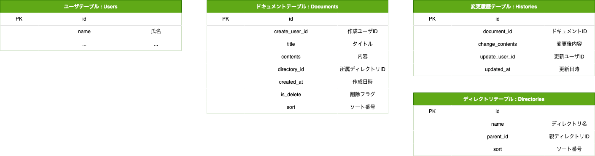

## 課題1
(課題2もまとめて確認してて、一つの課題だと思ってました...)

この課題では、ディレクトリを作成するため、木構造（ツリー構造）を実現する必要があります。<br>
これを解決するには、以下の方法が存在するようです。<br>

- 隣接リスト
- 経路列挙
- 入れ子集合
- 閉包テーブル

それぞれメリット、デメリットがありますが、「閉包テーブル」が良いという意見が多いようです。<br>
しかし、閉包テーブルの場合、レコード量が膨大になる、更新処理が複雑になるなどのデメリットがあり、<br>
また、MySQL8.0からは、再帰クエリをサポートしているため、シンプルな構造で管理できる「隣接リスト」で対応しています。



sortは、同じ階層内で指定されている場合に、使用します。
第一ソートがsortとなり、第二ソートidとなるイメージです。

**特定の投稿のディレクトリ取得**
```
LOCK TABLES directories READ, directories as child READ, documents READ;

WITH RECURSIVE tmp AS
  (
    SELECT id, name, parent_id
    FROM directories
    WHERE id = (
      SELECT directory_id FROM documents WHERE id = 1
    )

    UNION ALL

    SELECT child.id, child.name, child.parent_id
    FROM tmp
    JOIN directories as child
    ON tmp.parent_id = child.id
  )
SELECT * FROM tmp;

UNLOCK TABLES;
```

**DogとCatディレクトリの親にAnimalディレクトリを追加**
```
LOCK TABLES directories WRITE;
INSERT INTO directories (name, parent_id) VALUES ('Animal', 0);
UPDATE directories SET parent_id = (SELECT LAST_INSERT_ID()) WHERE id IN (1, 2);
UNLOCK TABLES;
```

ロック処理についての補足。
ディレクトリは複数ユーザから操作される可能性があります。
CatディレクトリをDogディレクトリの下に置く操作と
DogディレクトリをCatディレクトリの下に置く操作を同時に行う等した時に、不整合なデータが生まれることになります。
それを防ぐためにテーブルロックをしております。

<details><summary>テスト用SQL</summary>

```rb
CREATE DATABASE IF NOT EXISTS db_modering3;
use db_modering3;
-- ===== ユーザテーブル =====

CREATE TABLE users(
    id int unsigned NOT NULL AUTO_INCREMENT,
    name varchar(20) comment '氏名',
    PRIMARY KEY (id)
);

INSERT INTO users VALUES
  (1, '田中'),
  (2, '小林');

-- ===== ドキュメントテーブル =====
CREATE TABLE documents(
    id int unsigned NOT NULL AUTO_INCREMENT,
    create_user_id int unsigned NOT NULL,
    title varchar(20) comment 'タイトル',
    contents text NOT NULL,
    directory_id int unsigned NOT NULL,
    created_at datetime NOT NULL comment '作成日時',
    is_delete tinyint(1) comment '削除フラグ',
    sort int unsigned DEFAULT 0 comment 'ソート番号',
    PRIMARY KEY (id)
);

INSERT INTO documents VALUES
  (1, 1, '犬1', '内容内容内容', 1, '2022-11-01 07:00:00', 0, 0),
  (2, 2, '犬2', '内容内容内容', 1, '2022-11-01 07:00:00', 0, 1),
  (3, 2, '猫1', '内容内容内容', 2, '2022-11-01 07:00:00', 0, 0);

-- ===== 変更履歴テーブル =====
CREATE TABLE histories(
    id int unsigned NOT NULL AUTO_INCREMENT,
    document_id int unsigned NOT NULL comment 'ドキュメントID',
    change_contents text NOT NULL comment '変更後内容',
    update_user_id int unsigned NOT NULL comment '更新ユーザID',
    updated_at datetime NOT NULL comment '更新日時',
    PRIMARY KEY (id)
);

INSERT INTO histories VALUES
  (1, 1, '- 内容内容 \n+ が無いよう', 1, '2022-11-01 07:01:00');

-- ===== ディレクトリテーブル =====
CREATE TABLE directories(
    id int unsigned NOT NULL AUTO_INCREMENT,
    name varchar(20) comment 'ディレクトリ名',
    parent_id int unsigned NOT NULL comment '親ディレクトリID',
    sort int unsigned DEFAULT 0 comment 'ソート番号',
    PRIMARY KEY (id)
);

INSERT INTO directories VALUES
  (1, 'Dog', 0, 0),
  (2, 'Cat', 0, 1);
```
</details>

## 課題2
変更なし
